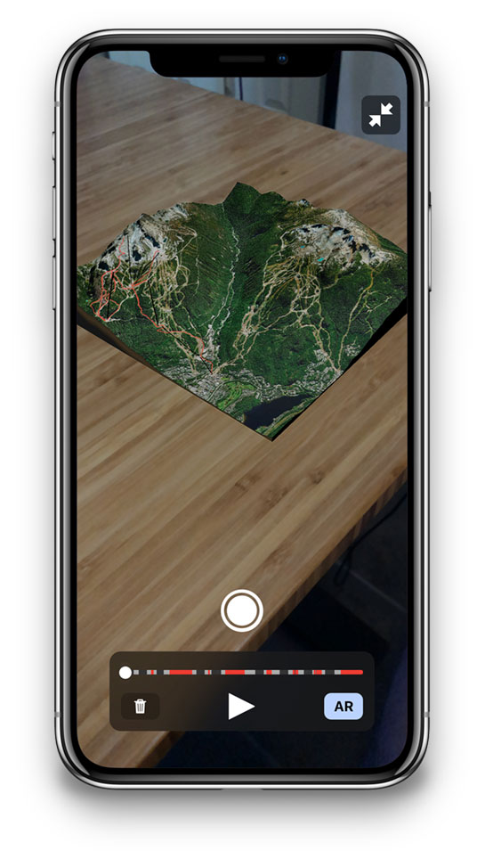

# Mapbox Scene Kit SDK for iOS



Using Swift, bringing our rich 3D terrain into your iOS app is easy. SceneKit SDK benefits from Apple’s toolchain and tight integration with ARKit. Using Apple's built-in Scene Kit frameworks means you can leverage compelling virtual terrain experiences without bloating your app's size.

**Note this SDK is in its beta phase and will be under heavy development as we move towards our 1.0**

## Requirements

The Mapbox Scene Kit SDK are compatible with applications written in Swift 4 or Objective-C in Xcode 9.0, and require iOS 10 or above (the examples require iOS 11 or above).

## Installation

### Using CocoaPods

To install Mapbox Scene Kit using [CocoaPods](https://cocoapods.org/):

1. Create a [Podfile](https://guides.cocoapods.org/syntax/podfile.html) with the following specification:
   ```ruby
   pod 'MapboxSceneKit', :git => 'https://github.com/mapbox/mapbox-scenekit.git'
   ```

1. Run `pod repo update && pod install` and open the resulting Xcode workspace.

### Using Carthage

Alternatively, to install Mapbox SceneKit using [Carthage](https://github.com/Carthage/Carthage/):

1. Create a [Cartfile](https://github.com/Carthage/Carthage/blob/master/Documentation/Artifacts.md#github-repositories) with the following dependency:
   ```cartfile
   github "mapbox/mapbox-scenekit"
   ```

1. Run `carthage update --platform iOS` to build just the iOS dependencies.

1. Follow the rest of [Carthage’s iOS integration instructions](https://github.com/Carthage/Carthage#if-youre-building-for-ios-tvos-or-watchos). Your application target’s Embedded Frameworks should include MapboxSceneKit.framework.

## Configuration

1. Mapbox APIs and vector tiles require a Mapbox account and API access token. In the project editor, select the application target, then go to the Info tab. Under the “Custom iOS Target Properties” section, set `MGLMapboxAccessToken` to your access token. You can obtain an access token from the [Mapbox account page](https://www.mapbox.com/account/access-tokens/).

## Examples

1. Clone the repository or download the [.zip file](https://github.com/mapbox/mapbox-scenekit/archive/master.zip)
1. Run `carthage update --platform ios` to build just the iOS dependencies.
1. Open `MapboxSceneKit.xcodeproj`.
1. Sign up or log in to your Mapbox account and grab a [Mapbox Access Token](https://www.mapbox.com/studio/account/tokens/).
1. Open the Info.plist for `Example` and paste your [Mapbox Access Token](https://www.mapbox.com/studio/account/tokens/) into `MGLMapboxAccessToken`. (Alternatively, if you plan to use this project as the basis for a public project on GitHub, place the access token in a plain text file named `.mapbox` or `mapbox` in your home directory instead of adding it to Info.plist.)
1. Build and run the `Examples` target.

## Contributing

We welcome feedback and code contributions! Please see [CONTRIBUTING.md](./CONTRIBUTING.md) for details.

## License

Mapbox SceneKit SDK for iOS is released under the ISC License. See [LICENSE.md](https://github.com/mapbox/mapbox-scenekit/blob/master/LICENSE.md) for details.
